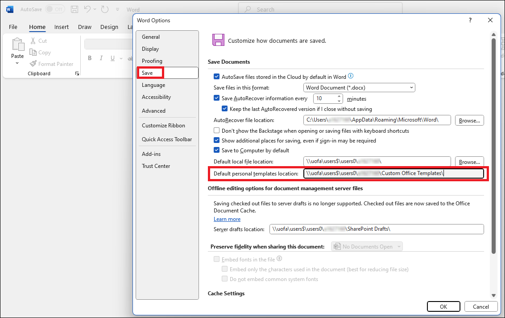
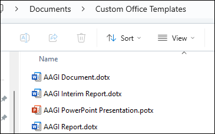
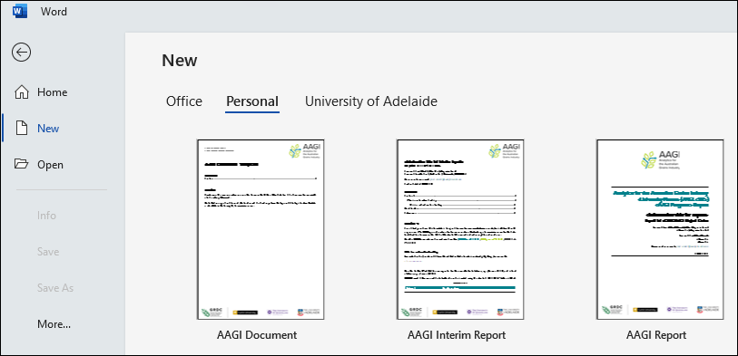
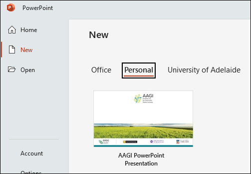
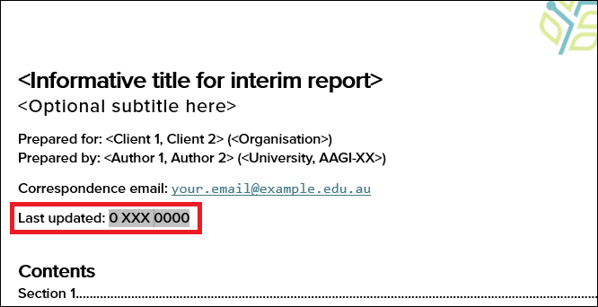
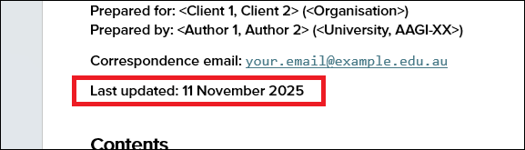

# AAGIOfficeTemplates

<!-- Badges -->

This repository contains Microsoft Word and PowerPoint templates that AAGI staff
can use to create documents and presentations which have a consistent AAGI style and
theming.

| [AAGI Report](https://github.com/AAGI-AUS/AAGIOfficeTemplates/raw/main/AAGI%20Report.dotx)| [AAGI Interim Report](https://github.com/AAGI-AUS/AAGIOfficeTemplates/raw/main/AAGI%20Interim%20Report.dotx)| [AAGI Document](https://github.com/AAGI-AUS/AAGIOfficeTemplates/raw/main/AAGI%20Document.dotx)| [AAGI Presentation](https://github.com/AAGI-AUS/AAGIOfficeTemplates/raw/main/AAGI%20PowerPoint%20Presentation.potx)|
|:-:|:-:|:-:|:-:|

Use these templates when preparing your AAGI reports, presentations, and other documents.

- **[AAGI Report](https://github.com/AAGI-AUS/AAGIOfficeTemplates/raw/main/AAGI%20Report.dotx)**: An AAGI-themed template for project 
  reports. Use this template for the 'large' (i.e., project conclusion) reports, such 
  as major milestone reports for Research & Development investments, or analytics
  reports to clients for Service & Support investments.
- **[AAGI Interim Report](https://github.com/AAGI-AUS/AAGIOfficeTemplates/raw/main/AAGI%20Interim%20Report.dotx)**: An AAGI-themed 'small'
  report template, designed for shorter (i.e., 3-4 page) reports. Use this template
  for summary or interim reporting to clients or for investment milestones.
- **[AAGI Document](https://github.com/AAGI-AUS/AAGIOfficeTemplates/raw/main/AAGI%20Document.dotx)**: A general AAGI-themed document template.
  Use this template for miscellaneous documents such as guides, overviews, 
  checklists, media releases, memos, and others.
- **[AAGI Presentation](https://github.com/AAGI-AUS/AAGIOfficeTemplates/raw/main/AAGI%20PowerPoint%20Presentation.potx)**: AAGI-theming for
  PowerPoint presentation slides. Use this template for presentations showcasing
  your AAGI project work, or when representing the AAGI brand at events.

## Installation & Usage Instructions

The AAGI report and presentation templates for Microsoft Word and Microsoft PowerPoint
can be installed easily on Windows 11 with the following steps.

1. Download the .dotx and .potx template files from this GitHub repository to your
   computer (e.g., by clicking the following links):
   - [AAGI Report.dotx](https://github.com/AAGI-AUS/AAGIOfficeTemplates/raw/main/AAGI%20Report.dotx)
   - [AAGI Interim Report.dotx](https://github.com/AAGI-AUS/AAGIOfficeTemplates/raw/main/AAGI%20Interim%20Report.dotx)
   - [AAGI Document.dotx](https://github.com/AAGI-AUS/AAGIOfficeTemplates/raw/main/AAGI%20Document.dotx)
   - [AAGI PowerPoint Presentation.potx](https://github.com/AAGI-AUS/AAGIOfficeTemplates/raw/main/AAGI%20PowerPoint%20Presentation.potx)
2. Open Microsoft Word and open the _File&rarr;Options_ window. Navigate to the 
   _Save_ menu and note the _Default personal templates location_, if one is
   listed, as shown. (If no directory is listed, you can choose whatever
   directory you like and enter its directory path here to set it as the
   default templates location for Microsoft Office.) 
3. Copy and paste the template files that you downloaded in Step 1 into that
   default templates location directory. 
4. Close Microsoft Word (as well as any other open Word windows).
5. Open Word again and it should load the new templates. Navigate to _File&rarr;New_
   and scroll down to select _Personal_ and the AAGI templates should now appear
   in the list for you to use. 
6. Similarly, when you open Microsoft PowerPoint and navigate to _File&rarr;New_,
   the AAGI Presentation template should appear in the _Personal_ list of
   templates. 
7. Click the template in the list to start a new document using that template.
   Replace the placeholder text as appropriate (e.g., replace `<Client>` with the
   name of the client for who the report is being written, replace `<University>`
   with the name of your University, replace `<AAGI-XX>` with your specific
   AAGI node, and so on).

**Note 1**: The templates use, but _are not bundled with_ (for trademark reasons),
the Proxima Nova Medium font. For the best aesthetics, it is highly recommended
that you install the Proxima Nova Medium (OTF) font when using the document and
presentation templates. AAGI staff should contact the AAGI administration team if
they need help with getting and installing this font to their computer.

**Note 2**: When you first start a new document with the template, dates may
appear malformed like `0 XXX 0000`, as shown:
  This is normal. That `0 XXX 0000` bit
is the _SaveDate_ field, which does not exist yet until you have saved the document
for the first time.
Once you have saved the document, from that point on the field will always show
the date of the most recent document save, as expected.
 

## Acknowledgements & Notices

These Microsoft Word and PowerPoint templates for AAGI documents were created and
developed under
the AAGI Research & Development investment **AAGI-AU-RD-WOP**, with guidance
provided by the AAGI Strategic Partner leads and feedback from the wider 
community of AAGI researchers and professionals.

### All Rights Reserved

Please note that these document templates have been made public for the strict
purposes of transparency and ease of access for AAGI staff. 
**No licence is provided** for the use of these templates outside of official
AAGI work conducted by AAGI personnel.

The AAGI project and the AAGI Strategic Partners retain full ownership and
rights to the AAGI logo. GRDC, Curtin University, the University of Queensland,
and Adelaide University retain full rights to their respective institutional logos.

The use of the AAGI logo together with the Strategic Partner logo
block abides by the standards set for AAGI project documents and outputs. The size
and positioning for the logos must not be modified without authorisation.

### Feedback & Contributing

Feedback on the use of the AAGI document and presentation templates is always
welcome. If you wish to provide feedback on the templates or any related 
materials, please use the [GitHub Issue Tracker](https://github.com/AAGI-AUS/AAGIOfficeTemplates/issues) for this repository. 
Alternatively, get in touch with one of the AAGI-AU-RD-WOP project leads:

- Curtin University: Prof. Adam Sparks ([@adamhsparks](https://github.com/adamhsparks))
- University of Queensland: Dr Robert Armstrong ([@rnarmstrong71](https://github.com/rnarmstrong71))
- Adelaide University: Mr Sam Rogers ([@rogerssam](https://github.com/rogerssam))
