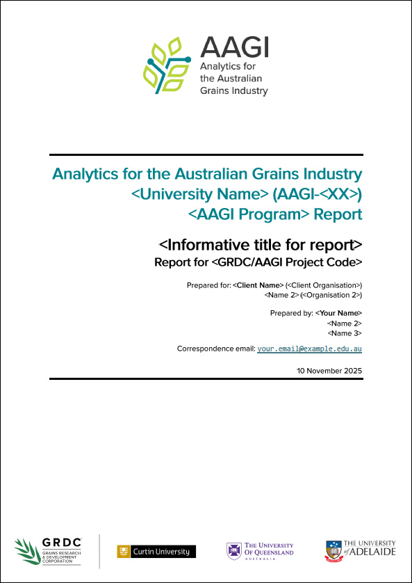
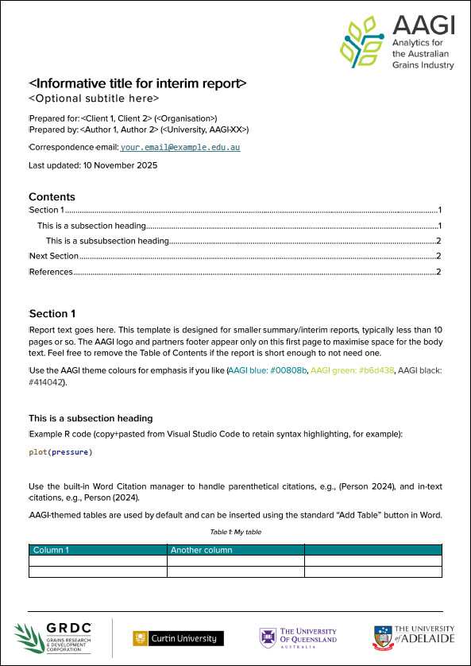
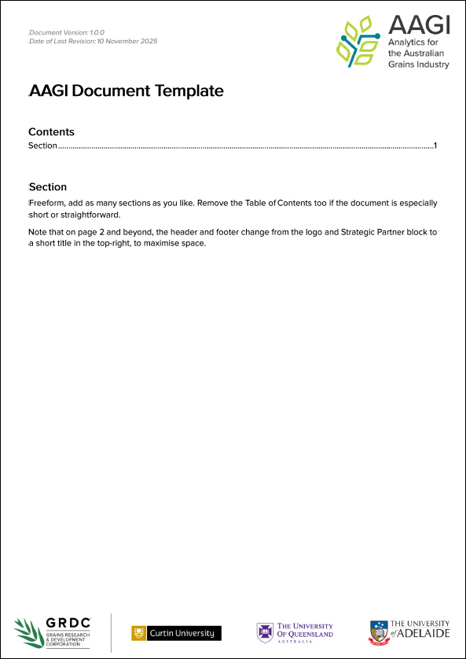
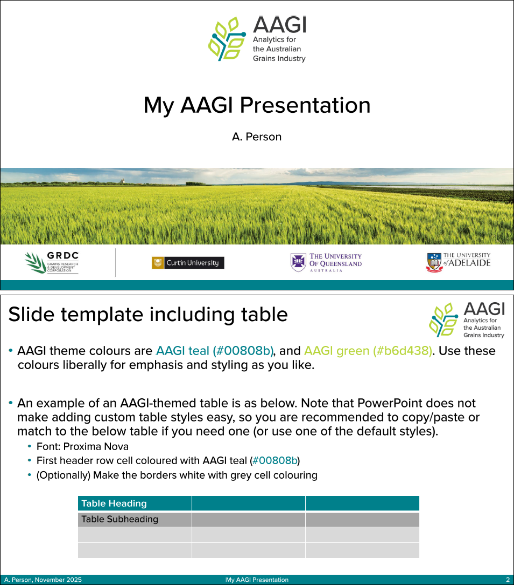

# AAGIOfficeTemplates

<!-- Badges -->

This repository contains Microsoft Word and PowerPoint templates that AAGI staff
can use to create documents and presentations which have a consistent AAGI style and
theming.

| [AAGI Report](/AAGI%20Report.dotx)| [AAGI Interim Report](/AAGI%20Interim%20Report.dotx)| [AAGI Document](/AAGI%20Document.dotx)| [AAGI Presentation](/AAGI%20PowerPoint%20Presentation.potx)|
|:-:|:-:|:-:|:-:|

Use these templates when preparing your AAGI reports, presentations, and other documents.

- **[AAGI Report](/AAGI%20Report.dotx)**: An AAGI-themed template for project 
  reports. Use this template for the 'large' (i.e., project conclusion) reports, such 
  as major milestone reports for Research & Development investments, or analytics
  reports to clients for Service & Support investments.
- **[AAGI Interim Report](/AAGI%20Interim%20Report.dotx)**: An AAGI-themed 'small'
  report template, designed for shorter (i.e., 3-4 page) reports. Use this template
  for summary or interim reporting to clients or for investment milestones.
- **[AAGI Document](/AAGI%20Document.dotx)**: A general AAGI-themed document template.
  Use this template for miscellaneous documents such as guides, overviews, 
  checklists, media releases, memos, and others.
- **[AAGI Presentation](/AAGI%20PowerPoint%20Presentation.potx)**: AAGI-theming for
  PowerPoint presentation slides. Use this template for presentations showcasing
  your AAGI project work, or when representing the AAGI brand at events.

## Installation & Usage Instructions

TODO

## Acknowledgements & Notices

These Microsoft Word and PowerPoint templates for AAGI documents were created and
developed under
the AAGI Research & Development investment **AAGI-AU-RD-WOP**, with guidance
provided by the AAGI Strategic Partner leads and feedback from the wider 
community of AAGI researchers and professionals.

### All Rights Reserved

Please note that these document templates have been made public for the strict
purposes of transparency and ease of access for AAGI staff. 
**No licence is provided** for the use of these templates outside of official
AAGI work conducted by AAGI personnel.

The AAGI project and the AAGI Strategic Partners retain full ownership and
rights to the AAGI logo. GRDC, Curtin University, the University of Queensland,
and Adelaide University retain full rights to their respective institutional logos.

The use of the AAGI logo together with the Strategic Partner logo
block abides by the standards set for AAGI project documents and outputs. The size
and positioning for the logos must not be modified without authorisation.

### Feedback & Contributing

Feedback on the use of the AAGI document and presentation templates is always
welcome. If you wish to provide feedback on the templates or any related 
materials, please use the [GitHub Issue Tracker](/issues) for this repository. 
Alternatively, get in touch with one of the AAGI-AU-RD-WOP project leads:

- Curtin University: Prof. Adam Sparks (@adamhsparks)
- University of Queensland: Dr Robert Armstrong (@rnarmstrong71)
- Adelaide University: Mr Sam Rogers (@rogerssam)
